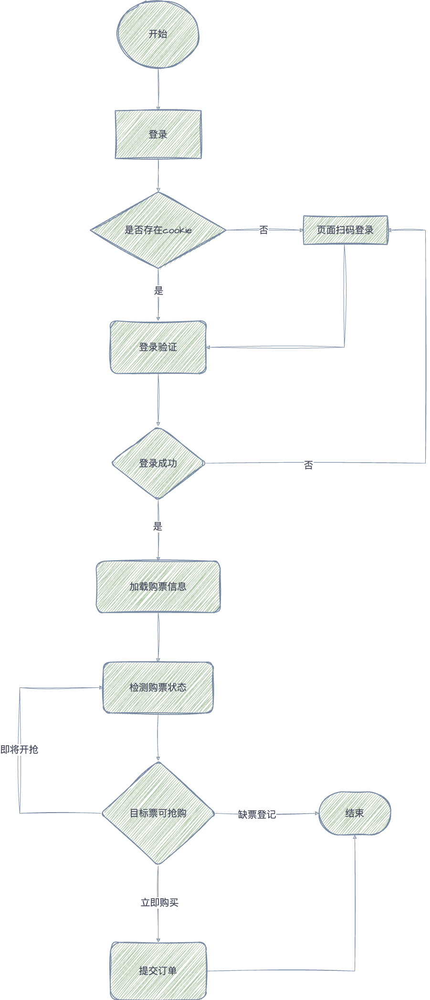
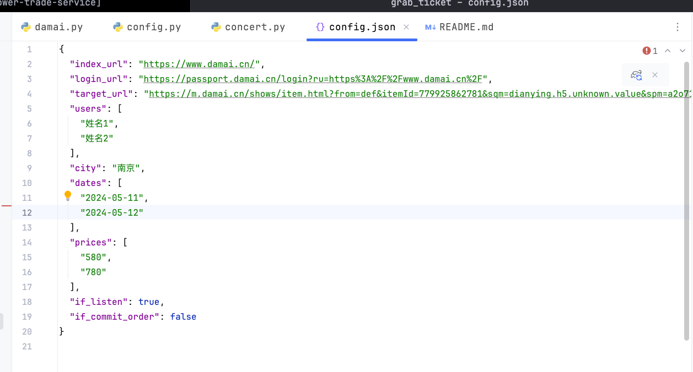
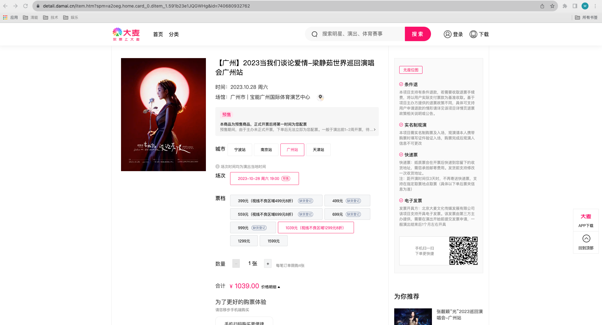
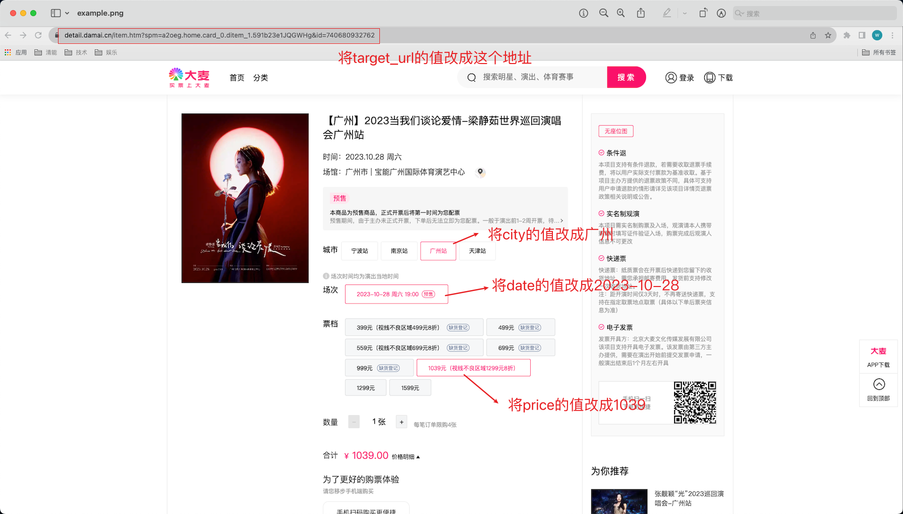

# 大麦抢票脚本 V2.0

基于原项目 [WECENG/ticket-purchase](https://github.com/WECENG/ticket-purchase) 的增强版本

## 特征

• 自动无延时抢票
• 支持人员、城市、日期场次、价格选择
• **新增GUI图形界面版本（推荐使用）**
• **智能Cookie登录管理**
• **支持预订和购票按钮识别**
• **自动循环抢票功能**

## 功能介绍

通过selenium打开页面进行登录，模拟用户购票流程自动购票。

**新增特性：**
- 🖥️ **GUI图形界面** - 简单易用的可视化操作
- 🔐 **Cookie自动保存** - 登录一次，持久使用
- 🎯 **智能元素识别** - 支持预订、购票等多种按钮
- 🔄 **自动循环模式** - GUI和命令行版本均支持
- 📱 **移动端支持** - 基于Appium的移动端版本

其流程图如下:



## 准备工作

### 1. 配置环境

#### 1.1 安装Python3环境

**Windows**

1. 访问Python官方网站：https://www.python.org/downloads/windows/
2. 下载最新的Python 3.9+版本的安装程序
3. 运行安装程序
4. 在安装程序中，确保勾选 "Add Python X.X to PATH" 选项，这将自动将Python添加到系统环境变量中，方便在命令行中使用Python
5. 完成安装后，你可以在命令提示符或PowerShell中输入 `python` 来启动Python解释器

**macOS**

你可以使用Homebrew来安装Python 3：

• 安装Homebrew（如果未安装）：打开终端并运行以下命令：
```bash
/bin/bash -c "$(curl -fsSL https://raw.githubusercontent.com/Homebrew/install/HEAD/install.sh)"
```

• 安装Python 3：运行以下命令来安装Python 3：
```bash
brew install python@3
```

#### 1.2 安装所需要的环境

在命令窗口输入如下指令：

```bash
# 安装基础依赖
pip install selenium

# 或者使用项目提供的requirements.txt
pip install -r requirements.txt

# 如果使用Poetry（推荐）
poetry install
```

#### 1.3 下载Google Chrome浏览器

下载地址: https://www.google.cn/intl/zh-CN/chrome/

**注意：** 程序会自动管理ChromeDriver，无需手动下载。

### 2. 修改配置文件

在运行程序之前，需要先修改`config.json`文件。该文件用于指定用户需要抢票的相关信息，包括演唱会的场次、观演的人员、城市、日期、价格等。文件结构如下图所示：



#### 2.1 文件内容说明

• `index_url`为大麦网的地址，无需修改
• `login_url`为大麦网的登录地址，无需修改
• `target_url`为用户需要抢的演唱会票的目标地址，**待修改**
• `users`为观演人的姓名，观演人需要用户在手机大麦APP中先填写好，然后再填入该配置文件中，**待修改**
• `city`为城市，如果用户需要抢的演唱会票需要选择城市，请把城市填入此处。如无需选择，则不填
• `date`为场次日期，**待修改**，可多选
• `price`为票档的价格，**待修改**，可多选
• `if_commit_order`为是否要自动提交订单，改成 true
• `if_listen`为是否回流监听，改成 true

#### 2.2 示例说明

进入大麦网 https://www.damai.cn/ ，选择你需要抢票的演唱会。假设如下图所示：



接下来按照下图的标注对配置文件进行修改：



最终`config.json`的文件内容如下：

```json
{
  "index_url": "https://www.damai.cn/",
  "login_url": "https://passport.damai.cn/login?ru=https%3A%2F%2Fwww.damai.cn%2F",
  "target_url": "https://detail.damai.cn/item.htm?spm=a2oeg.home.card_0.ditem_1.591b23e1JQGWHg&id=740680932762",
  "users": [
    "名字1",
    "名字2"
  ],
  "city": "广州",
  "date": "2023-10-28",
  "price": "1039",
  "if_listen": true,
  "if_commit_order": true
}
```

### 3. 运行程序

#### 方式一：GUI图形界面（推荐）

**双击启动**（最简单）：
```
双击运行: 一键启动GUI版本.bat
```

**Python命令启动**：
```bash
python damai_gui.py
```

**特点：**
- 🖥️ 友好的图形界面
- 🔐 智能Cookie管理
- 📊 实时日志显示
- 🎯 可视化参数配置
- 🔄 自动循环抢票

#### 方式二：命令行版本

**双击启动**：
```
双击运行: 一键启动命令行版本.bat
```

**Python命令启动**：
```bash
cd damai
python damai.py
```

## 移动端版本

本项目还提供基于Appium的移动端抢票版本，适用于Android设备。

### Appium Server环境配置

#### 下载和安装

• 先安装好node环境（具备npm）node版本号18.0.0+
• 先下载并安装好Android SDK，并配置环境变量（appium server运行需依赖android sdk)
• 下载appium

```bash
npm install -g appium
```

• 查看appium是否安装成功

```bash
appium -v
```

• 下载UiAutomator2驱动

```bash
npm install appium-uiautomator2-driver
```

如果遇到ChromeDriver相关错误，可以设置环境变量跳过：

```bash
export APPIUM_SKIP_CHROMEDRIVER_INSTALL=true
```

#### 启动Appium Server

启动appium server并使用uiautomator2驱动：

```bash
appium --use-plugins uiautomator2
```

启动成功将出现如下信息：

```
[Appium] Welcome to Appium v2.2.1
[Appium] Appium REST http interface listener started on http://0.0.0.0:4723
[Appium] You can provide the following URLs in your client code to connect to this server:
[Appium] 	http://127.0.0.1:4723/ (only accessible from the same host)
```

其中 `http://127.0.0.1:4723/` 为appium server连接地址

### Appium Client配置

• 安装Python客户端

```bash
pip install appium-python-client
```

• 运行移动端脚本

```bash
cd damai_appium
python damai_app.py
```

## 项目结构

```
damai-ticket-assistant/
├── damai_gui.py              # GUI主程序
├── gui_concert.py            # GUI专用抢票模块
├── start_gui.pyw            # 一键启动脚本
├── 一键启动GUI版本.bat        # GUI图形界面启动
├── 一键启动命令行版本.bat      # 命令行版本启动
├── damai/                   # 命令行版本模块
│   ├── damai.py            # 命令行主程序
│   ├── concert.py          # 抢票核心逻辑
│   └── config.json         # 配置文件
├── damai_appium/           # 移动端版本
│   ├── damai_app.py       # 移动端主程序
│   └── config.json        # 移动端配置
├── tests/                  # 测试文件
├── requirements.txt        # Python依赖
├── pyproject.toml         # Poetry配置
└── img/                   # 项目截图和流程图
```

## ⚠️ 免责声明

**本项目仅供学习和技术交流使用，请务必遵守以下条款：**

1. **合法合规使用**：本工具仅用于学习 Selenium 自动化技术，请勿用于任何商业用途或违反服务条款的行为
2. **风险自负**：使用本工具可能存在账号被封禁、订单异常等风险，使用者需自行承担所有后果
3. **尊重平台规则**：请严格遵守大麦网的用户协议和服务条款，不得进行恶意刷票或影响平台正常运营的行为
4. **技术研究目的**：本项目主要用于研究网页自动化技术，不鼓励大规模或商业化使用

**使用本工具即表示您已阅读并同意上述免责声明。**

## 致谢

本项目基于 [WECENG/ticket-purchase](https://github.com/WECENG/ticket-purchase) 进行开发和优化，感谢原作者的贡献。