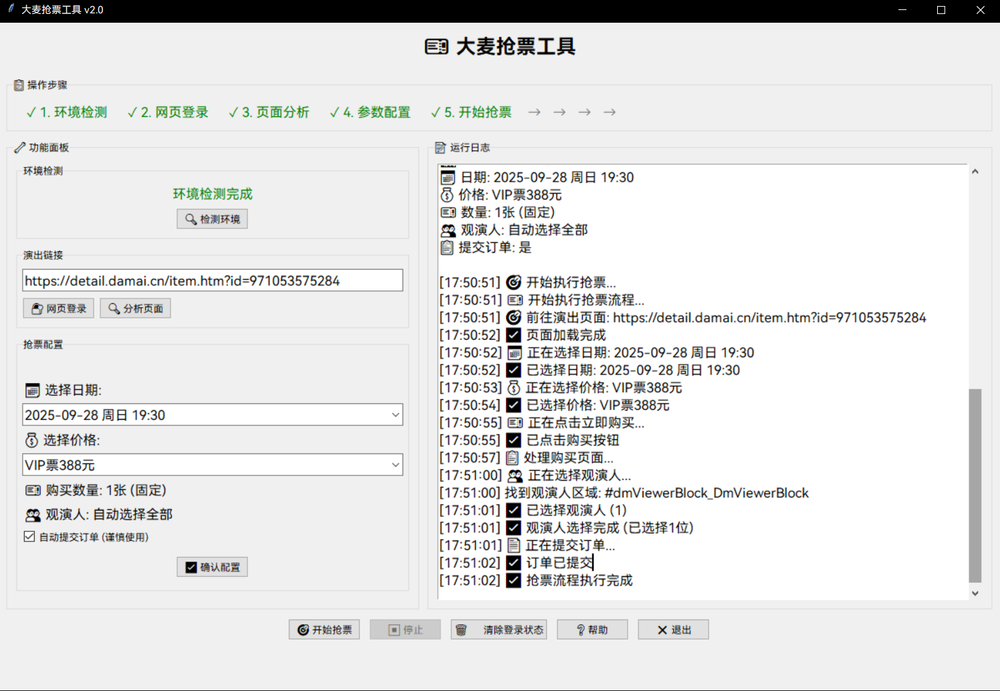

## ⚠️ 免责声明

**本项目仅供学习和技术交流使用，请务必遵守以下条款：**

1. **合法合规使用**：本工具仅用于学习 Selenium 自动化技术，请勿用于任何商业用途或违反服务条款的行为
2. **风险自负**：使用本工具可能存在账号被封禁、订单异常等风险，使用者需自行承担所有后果
3. **尊重平台规则**：请严格遵守大麦网的用户协议和服务条款，不得进行恶意刷票或影响平台正常运营的行为
4. **技术研究目的**：本项目主要用于研究网页自动化技术，不鼓励大规模或商业化使用
5. **免责条款**：开发者不对使用本工具造成的任何损失承担责任，包括但不限于账号封禁、财产损失等

**使用本工具即表示您已阅读并同意上述免责声明。如不同意，请立即停止使用。**

---

# 大麦抢票工具 🎫

一个功能完善的大麦网自动抢票工具，提供图形界面和命令行两种使用方式。



## ✨ 核心功能

### 🖥️ GUI图形界面 (推荐)

- **一键式操作** - 简单易用的图形界面
- **智能登录管理** - Cookie自动保存，免重复登录
- **页面智能分析** - 自动解析演出信息和选项
- **参数化配置** - 可视化选择城市、日期、价格
- **实时日志显示** - 清晰显示抢票进度和状态

### 🤖 自动抢票功能

- **购买按钮智能识别** - 支持多种页面结构
- **观演人自动选择** - 智能识别并选择观演人
- **订单自动提交** - 可选的自动提交功能
- **弹窗智能处理** - 自动处理各种页面弹窗

### 🔐 登录状态管理

- **Cookie持久化** - 登录状态自动保存
- **免重复登录** - 启动时自动尝试登录
- **状态智能检测** - 自动验证登录有效性
- **手动管理选项** - 可手动清除登录状态

## 🚀 快速开始

### 方式一：智能启动 (🔰新用户推荐)

```
双击运行 一键启动.bat
```

**特点：**
- ✅ 自动检测Python环境
- ✅ 自动安装缺失依赖
- ✅ 详细错误提示和解决方案
- ✅ 适合首次使用或环境有问题时

### 方式二：快速启动 (⚡熟练用户)

```
GUI版本：双击运行 start_gui.pyw
```

**特点：**
- ⚡ 快速启动，无额外检测
- 💡 适合环境已配置好的用户
- ⚠️ 需要已安装Python和依赖库

### 方式二：Python运行

**⚠️ 重要提示：新用户需要先安装依赖库！**

**最简单的方法：**
```
pip install -r requirements.txt
```

**手动安装方法：**
```bash
# 安装依赖（必须）
pip install -r requirements.txt

# 启动GUI界面
python damai_gui.py

# 或使用一键启动脚本
python start_gui.pyw
```

**如果遇到闪退问题，请检查：**

1. ✅ Python是否正确安装并添加到PATH
2. ✅ 是否已运行 `pip install -r requirements.txt`
3. ✅ 是否安装了Chrome浏览器

**推荐使用双击bat文件启动，会自动检测并安装依赖！**

## 📋 使用流程

1. **环境检测** - 自动检测Python和Chrome环境
2. **网页登录** - 可选的预登录或抢票时登录
3. **页面分析** - 输入演出链接，自动分析可选项
4. **参数配置** - 选择城市、日期、价格等参数
5. **开始抢票** - 一键启动自动抢票流程

## 🛠️ 环境配置

### 安装Python3环境

#### Windows

1. 访问Python官方网站：[https://www.python.org/downloads/windows/](https://www.python.org/downloads/windows/)
2. 下载最新的Python 3.9+版本的安装程序
3. 运行安装程序
4. 在安装程序中，**确保勾选 "Add Python X.X to PATH" 选项**，这将自动将Python添加到系统环境变量中，方便在命令行中使用Python
5. 完成安装后，你可以在命令提示符或PowerShell中输入 `python` 来启动Python解释器

#### macOS

你可以使用Homebrew来安装Python 3：

• 安装Homebrew（如果未安装）：打开终端并运行以下命令：
```bash
/bin/bash -c "$(curl -fsSL https://raw.githubusercontent.com/Homebrew/install/HEAD/install.sh)"
```

• 安装Python 3：运行以下命令来安装Python 3：
```bash
brew install python@3
```

#### 验证安装

安装完成后，在终端/命令提示符中运行以下命令验证安装：

```bash
python --version
# 或者
python3 --version
```

如果显示Python版本号（如Python 3.9.x），说明安装成功。

### 环境要求

- **Python 3.7+**
- **Chrome浏览器** + **ChromeDriver**
- **依赖库**：
  - selenium
  - tkinter (Python标准库)
  - pickle (Python标准库)

## 📁 项目结构

```
ticket-assistant/
├── damai_gui.py              # GUI主程序
├── gui_concert.py            # GUI专用抢票模块
├── start_gui.pyw            # 一键启动脚本
├── 安装依赖.txt              # 依赖安装说明
├── 一键启动.bat              # 标准启动脚本
├── 一键启动2.bat             # 备用启动脚本
├── damai/                   # 命令行版本模块
├── damai_appium/           # 移动端版本(实验性)
├── requirements.txt        # Python依赖列表
└── img/                    # 项目截图和流程图
```

## 🔧 高级功能

### Cookie自动管理

- 首次登录后自动保存登录状态
- 下次启动自动尝试免登录
- 支持手动清除登录状态

### 智能元素识别

- 多种购买按钮识别策略
- 观演人选择区域智能定位
- 提交按钮文本智能匹配

### 增强的错误处理

- 多层fallback机制
- JavaScript辅助执行
- 详细的日志信息

## ⚠️ 使用注意

1. **合规使用** - 请严格遵守大麦网服务条款
2. **网络稳定** - 确保网络连接稳定可靠
3. **信息准确** - 抢票前确认个人信息完整
4. **理性使用** - 建议关闭自动提交，手动确认订单
5. **风险意识** - 了解使用自动化工具的潜在风险

## 🙏 致谢

本项目基于 [WECENG/ticket-purchase](https://github.com/WECENG/ticket-purchase) 进行开发和优化。

**特别感谢：**
- 原作者 **WECENG** 提供的优秀基础框架
- 所有为开源项目做出贡献的开发者们
- 提供建议和反馈的用户社区

## 🤝 贡献指南

欢迎提交Issue和Pull Request来改进项目：

1. Fork 本仓库
2. 创建您的特性分支 (`git checkout -b feature/AmazingFeature`)
3. 提交您的更改 (`git commit -m 'Add some AmazingFeature'`)
4. 推送到分支 (`git push origin feature/AmazingFeature`)
5. 开启一个 Pull Request

## 📄 开源协议

本项目采用 MIT 协议开源，详情请参考 LICENSE 文件。

**重要提醒：** 本项目仅供学习和技术研究使用，请勿用于任何违反平台服务条款的行为。

## 📞 技术支持

如果遇到技术问题，可以：

- 📋 查看项目 [Issues](https://github.com/10000ge10000/damai-ticket-assistant/issues)
- 📖 阅读详细文档和说明
- 💬 在仓库中提交新的Issue

**相关文档：**
- GUI界面使用指南
- Cookie功能说明文档
- 项目更新日志

---

## ⭐ 支持项目

如果这个项目对您有帮助，请考虑：

- 🌟 给本项目一个 Star
- 🔄 Fork 并贡献代码
- 📢 分享给其他开发者

**感谢您的支持！** 🎉