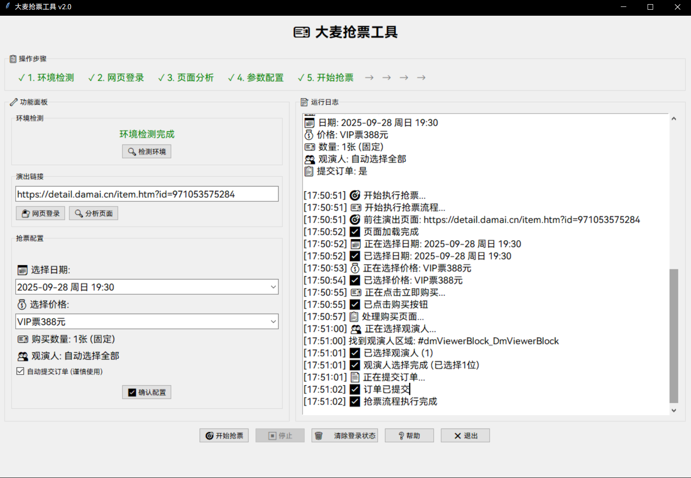

## ⚠️ 免责声明

**本项目仅供学习和技术交流使用，请务必遵守以下条款：**

1. **合法合规使用**：本工具仅用于学习 Selenium 自动化技术，请勿用于任何商业用途或违反服务条款的行为
2. **风险自负**：使用本工具可能存在账号被封禁、订单异常等风险，使用者需自行承担所有后果
3. **尊重平台规则**：请严格遵守大麦网的用户协议和服务条款，不得进行恶意刷票或影响平台正常运营的行为
4. **技术研究目的**：本项目主要用于研究网页自动化技术，不鼓励大规模或商业化使用
5. **免责条款**：开发者不对使用本工具造成的任何损失承担责任，包括但不限于账号封禁、财产损失等

**使用本工具即表示您已阅读并同意上述免责声明。如不同意，请立即停止使用。**

---

# 大麦抢票工具 🎫

一个功能完善的大麦网自动抢票工具，提供图形界面和命令行两种使用方式。




## ✨ 核心功能

### 🖥️ GUI图形界面 (推荐)

- **一键式操作** - 简单易用的图形界面
- **智能登录管理** - Cookie自动保存，免重复登录
- **页面智能分析** - 自动解析演出信息和选项
- **参数化配置** - 可视化选择城市、日期、价格
- **实时日志显示** - 清晰显示抢票进度和状态

### 📱 App 模式（移动端极速抢票）

- **Appium 驱动大麦App** - 支持 Android 设备极速自动化抢票
- **配置文件灵活** - 支持 config.jsonc/JSON 配置多设备、多场景参数
- **配置自动校验** - 载入配置时自动给出缺失字段与格式错误提示，避免运行期才发现问题
- **自动检测设备与服务** - 一键检测 Appium 服务与设备连接状态
- **手动刷新设备** - GUI 内置“刷新设备”按钮，实时同步 adb 检测结果
- **多重重试机制** - 支持自定义最大重试次数，提升成功率
- **阶段状态机监控** - 内置 RunnerPhase 状态机实时追踪流程阶段，日志定位更准确
- **依赖自检提示** - 自动校验 Node.js / Appium CLI / adb，并在缺失时给出安装指引
- **日志分级输出** - 步骤/成功/警告/异常一目了然
- **运行统计与导出** - 流程结束自动汇总尝试次数、耗时等指标，支持一键导出 JSON 日志

> 想要一步一步完成环境搭建与抢票流程？请阅读新版的 [App 模式零基础上手指南](docs/guides/APP_MODE_README.md)。

### 🤖 自动抢票功能

- **购买按钮智能识别** - 支持多种页面结构
- **观演人自动选择** - 智能识别并选择观演人
- **订单自动提交** - 可选的自动提交功能
- **弹窗智能处理** - 自动处理各种页面弹窗

### 🔐 登录状态管理

- **Cookie持久化** - 登录状态自动保存
- **免重复登录** - 启动时自动尝试登录
- **状态智能检测** - 自动验证登录有效性
- **手动管理选项** - 可手动清除登录状态

## 📋 使用流程概览

### 网页模式（Web）

- 提供环境检测、页面解析、观演人管理等可视化流程，引导完成完整抢票步骤。
- 内置登录状态保存、参数即时校验与日志跟踪，适合桌面端浏览器抢票场景。
- 完整的零基础教学请参考 [网页模式零基础上手指南](docs/guides/WEB_MODE_README.md)。

### App 模式（Appium 移动端）

- GUI 提供环境检测、设备刷新、日志及运行统计面板，适合需要可视化监控的用户。
- CLI/脚本模式支持顺序执行多个设备会话，并可导出 JSON 报告。
- 完整的零基础教学请参考 [App 模式零基础上手指南](docs/guides/APP_MODE_README.md)。


## 🔮 扩展路线（规划中）

### 多设备并行

- **核心思路**：在现有 Runner 层面抽象设备会话（session）列表，由调度器根据配置并行创建多个 `DamaiAppTicketRunner` 实例。
- **配置扩展**：计划支持 `devices` 数组，携带每台设备的 `server_url` / `device_caps`；GUI 侧将增加多选控件和批量校验。
- **执行模式**：
	- 单机并行：同一主机多个模拟器/真机，统一由 Appium Grid 或多个 Server 节点调度。
	- 分布式：通过 CLI/脚本在多台机器触发 runner，再通过日志上报/远程存储汇总结果。
- **风险与依赖**：需考虑 Appium Server 连接上限、ADB 并发性能，以及多进程日志写入的线程安全性。

### 定时任务 / 自动守候

- **触发机制**：
	- Windows：提供 `.ps1`/`.bat` 示例结合任务计划程序（Task Scheduler）。
	- Linux/macOS：提供 `cron` 与 `systemd` unit 模板，调用 `python -m damai_appium.damai_app_v2`。
- **参数注入**：外部调度器以环境变量或命令行参数注入场次、重试次数，实现定制化场景。
- **监控反馈**：预留 Webhook / 本地 JSON 日志查询接口，后续可接入飞书/企业微信通知。
- **后续工作**：完善脚本容错（重试/超时控制），并在 README 增补一键生成计划任务的示例片段。

## 🧩 环境要求

- **Python 3.7+**
- Chrome 浏览器（建议使用最新稳定版；Selenium Manager 会自动管理 ChromeDriver，无需手动安装）
- **核心依赖库**：
  - `selenium`
  - `Appium-Python-Client`
  - `tkinter`（Python 标准库）
  - `pickle`（Python 标准库）
- 建议使用 `pip install -r requirements.txt` 自动安装所有依赖。
- Windows 用户可以参考 [Windows 环境安装指南](docs/setup/windows_installation.md) 完成依赖配置。

## � 安装步骤（快速上手）

以下步骤适用于 Windows PowerShell，其他平台命令可自行等效替换。

1. 准备 Python 环境（推荐虚拟环境）

```powershell
# 进入项目根目录后创建并激活 venv
python -m venv .venv
.\.venv\Scripts\Activate.ps1

# 升级 pip 并安装项目依赖
python -m pip install -U pip
pip install -r requirements.txt
```

1. 安装 App 模式前置（Node.js / Appium / ADB）

- 安装 Node.js（LTS 版本），然后安装 Appium CLI 与 Doctor：

```powershell
npm install -g appium
npm install -g appium-doctor
appium-doctor --android
```

- 安装 Android Platform Tools（包含 adb），并将其 `platform-tools` 目录加入系统环境变量 `PATH`：
	- 参考官方下载页：<https://developer.android.com/tools/releases/platform-tools>
	- 将 `C:\\Android\\platform-tools`（或你的解压路径）追加到 PATH 后，建议重启系统以便所有程序生效。

1. 验证环境

```powershell
where adb
adb version
appium -v
```

1. 启动 Appium 服务（默认 4723 端口）

```powershell
appium
```

1. 连接并授权设备

```powershell
adb devices -l
# 若显示 unauthorized，请在手机上确认 USB 调试授权
```

1. 启动本工具的 GUI

- 方式一：Windows 脚本（推荐）
	- 双击 `scripts/windows/oneclick_start.bat`（一键安装 + 启动）
	- 或双击 `scripts/windows/start_gui.bat`（仅启动 GUI）
	- 如需查看详细日志，使用 `scripts/windows/debug_gui.bat`
- 方式二：PowerShell 启动
	- 在终端执行：`pwsh ./scripts/windows/install_all.ps1`（一键安装 + 可选启动）
- 方式三：Python 启动
	- 在已激活的虚拟环境中运行：`pythonw start_gui.pyw`

如需更完整的 App 模式图文说明与常见问题，请阅读：[App 模式零基础上手指南](docs/guides/APP_MODE_README.md)。

## �📁 项目结构

```text
damai-ticket-assistant/
├── damai_gui.py           # GUI 主程序
├── gui_concert.py         # GUI 专用抢票模块
├── start_gui.pyw          # Pythonw 启动脚本
├── damai/                 # 网页模式命令行模块
├── damai_appium/          # App 模式相关模块
├── docs/                  # 文档、指南、素材与安装说明
│   ├── assets/            # 项目截图与示意图
│   ├── diagrams/          # 流程图与设计文档
│   ├── guides/            # Web/App 零基础指南
│   └── setup/             # 环境安装与配置
├── examples/              # 示例脚本
├── scripts/               # 辅助脚本与批处理
│   ├── app_mode_quickstart.ps1
│   └── windows/
│       ├── start_gui.bat  # GUI 一键启动脚本
│       └── debug_gui.bat  # GUI 调试启动脚本
├── tests/                 # 自动化测试
├── vendor/                # 上游参考实现与资料
├── requirements.txt       # Python 依赖列表
├── poetry.lock            # Poetry 锁定文件
└── pyproject.toml         # 包管理与构建配置
```

## 🔧 高级功能

### Cookie自动管理

- 首次登录后自动保存登录状态
- 下次启动自动尝试免登录
- 支持手动清除登录状态

### 智能元素识别

- 多种购买按钮识别策略
- 观演人选择区域智能定位
- 提交按钮文本智能匹配

### 增强的错误处理

- 多层fallback机制
- JavaScript辅助执行
- 详细的日志信息

### 📊 运行统计与日志导出

- App 模式在流程结束后会自动汇总尝试次数、重试次数、总耗时与最终阶段等核心指标
- GUI 日志面板新增“导出日志”按钮，可一键导出包含运行报告与全部日志的 JSON 文件，方便排查与分享
- 命令行入口 `damai_app_v2.py` 会输出同样的运行摘要，并支持通过 `--export-report` 参数生成 JSON 报告

## ⚠️ 使用注意

1. **合规使用** - 请严格遵守大麦网服务条款
2. **网络稳定** - 确保网络连接稳定可靠
3. **信息准确** - 抢票前确认个人信息完整
4. **理性使用** - 建议关闭自动提交，手动确认订单
5. **风险意识** - 了解使用自动化工具的潜在风险

## 🙏 致谢

本项目基于 [WECENG/ticket-purchase](https://github.com/WECENG/ticket-purchase) 进行开发和优化。

**特别感谢：**

- 原作者 **WECENG** 提供的优秀基础框架
- 所有为开源项目做出贡献的开发者们
- 提供建议和反馈的用户社区

## 🤝 贡献指南

欢迎提交Issue和Pull Request来改进项目：

1. Fork 本仓库
2. 创建您的特性分支 (`git checkout -b feature/AmazingFeature`)
3. 提交您的更改 (`git commit -m 'Add some AmazingFeature'`)
4. 推送到分支 (`git push origin feature/AmazingFeature`)
5. 开启一个 Pull Request

## 📄 开源协议

本项目采用 MIT 协议开源，详情请参考 LICENSE 文件。

**重要提醒：** 本项目仅供学习和技术研究使用，请勿用于任何违反平台服务条款的行为。

## 📞 技术支持

如果遇到技术问题，可以：

- 📋 查看项目 [Issues](https://github.com/10000ge10000/damai-ticket-assistant/issues)
- 📖 阅读详细文档和说明
- 💬 在仓库中提交新的Issue

**相关文档：**

- GUI界面使用指南
- Cookie功能说明文档
- 项目更新日志

---

## ⭐ 支持项目

如果这个项目对您有帮助，请考虑：

- 🌟 给本项目一个 Star
- 🔄 Fork 并贡献代码
- 📢 分享给其他开发者

**感谢您的支持！** 🎉


## 🧳 离线一键安装（完全一键）

若需在无网络或受限网络环境中完成“完全一键安装+启动”，可使用离线依赖打包与本仓库内置的 vendor 优先安装流程。

- 离线指引与打包规范：
  - 详见文档 (docs/setup/OFFLINE_BUNDLE.md:1)，提供目录规范、打包方法与 CI 建议
- 生成离线包（wheel/node/appium/platform-tools）：
  - 在联网机器上运行 (scripts/windows/make_offline_vendor.ps1:1) 自动生成 vendor/ 目录
- 使用离线包进行一键安装：
  - 双击 (scripts/windows/oneclick_start.bat:1) 或在 PowerShell 执行：
    - `pwsh ./scripts/windows/install_all.ps1`（脚本已支持 vendor 优先、在线回退）
  - 安装脚本入口 (scripts/windows/install_all.ps1:1) 会优先使用 vendor/wheels（离线 pip 依赖）、vendor/node（Node.js Zip）、vendor/appium（Appium tgz）、vendor/platform-tools（ADB Zip）
- 目录结构与文件放置（示例）：
  - `vendor/wheels/*.whl`（pip 离线 wheelhouse）
  - `vendor/node/node-v20.x.y-win-x64.zip`（包含 node.exe 与 npm）
  - `vendor/appium/appium-*.tgz`、`appium-doctor-*.tgz`（通过 `npm pack` 生成）
  - `vendor/platform-tools/platform-tools-latest-windows.zip`（Android Platform Tools 原包）
- 备注与合规：
  - 浏览器不建议内置（体积大且更新频繁）；Selenium Manager 会自动管理 ChromeDriver
  - 分发第三方二进制请遵循各自许可证；可在发布物中附带 `THIRD_PARTY_NOTICES.txt`

使用流程（离线环境简要）
1. 在已准备好的离线 vendor/ 目录下，运行 (scripts/windows/oneclick_start.bat:1) 或 (scripts/windows/install_all.ps1:1)
2. 脚本将按“vendor 优先、在线回退”的策略执行依赖安装与 GUI 启动
3. 若某离线包缺失且无法联网，脚本会给出提示并保留兼容的手动路径（例如：手动解压 node Zip/Platform Tools 并加入 PATH）

如需发布企业/团队离线包，建议在 CI 中打包并附带校验文件后分发；参考 (docs/setup/OFFLINE_BUNDLE.md:1) 的“CI/CD 与发布产物”章节。
